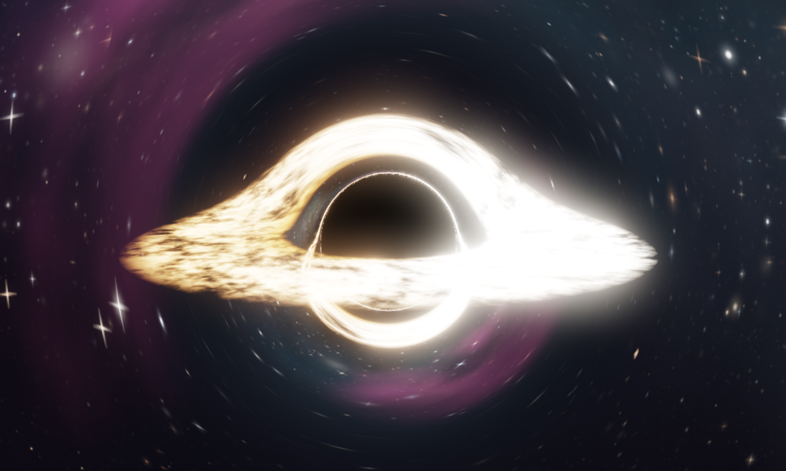
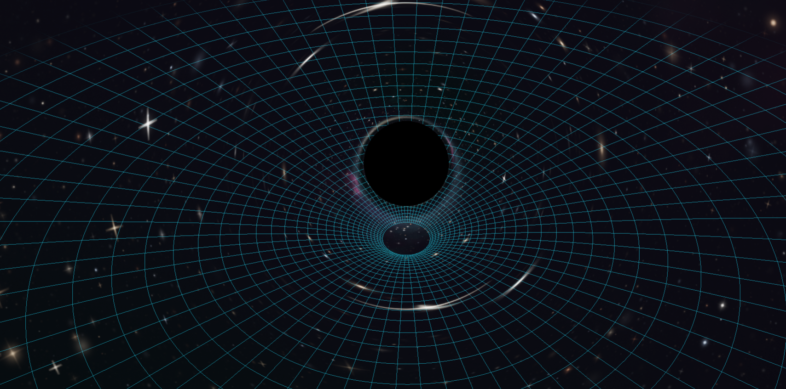

# blackhole-sim

[](https://github.com/algometrix/blackhole-sim/actions/workflows/ci.yml)
[](tsconfig.json)
[](https://threejs.org)
[](https://vite.dev)
[](src/sim/__tests__)
[](LICENSE)

An interactive black hole visualizer that ray-traces **real Schwarzschild photon geodesics on the GPU**, per pixel, every frame. It renders the event horizon shadow, the photon ring, a Doppler-beamed accretion disc bent over and under the hole (the *Interstellar* look), and a gravitationally lensed starfield. You can launch photons and watch their true paths, drop a planet or star and watch it be tidally shredded, and place a second black hole to watch a gravitational-wave inspiral end in a merger, complete with a LIGO-style audio chirp.

Everything runs in the browser. No backend, no textures, no libraries beyond Three.js: the stars, disc, physics, and sound are all procedural.



*A disruption in progress. The stream is debris on real orbits, the arcs around the shadow are background galaxies lensed by the same geodesics, and the whole sky is generated at boot.*



*The curvature grid (`G`): Flamm's paraboloid, the exact embedding of a Schwarzschild slice. During an inspiral the binary's gravitational waves ripple outward across it.*

## Features

- **Real GR light bending**: each pixel integrates the Schwarzschild null-geodesic equation with RK4 and adaptive stepping. The shadow, photon ring, Einstein-ring star smearing, and the disc's secondary images emerge from the math, not from textures.
- **Accretion disc**: Shakura–Sunyaev temperature profile, differential-rotation noise that shears into trailing spirals, relativistic Doppler + gravitational redshift using the bent photon direction (correct even for the lensed secondary image).
- **Interactive photon trajectories**: click to launch fans of photons; escaped, captured, and near-critical rays are drawn as glowing curves computed by the same integrator the shader uses.
- **Tidal disruption**: place a planet or star. *Cinematic* mode gives a directable inward spiral with spaghettification and a debris stream that feeds and brightens the disc. *Realistic TDE* mode launches a true zero-energy parabolic plunge, one violent shredding at pericenter, and a physically motivated bound/unbound debris split (roughly half the debris escapes, as in real TDEs).
- **Black hole merger**: place a second hole. Its orbit decays by the actual Peters (1964) gravitational-wave equations (the trajectory shape is exact; only wall-clock time is compressed). Both holes lens light. At contact the shadow swells to the merged mass minus the radiated gravitational-wave energy, with a ringdown wobble.
- **Deep sky**: the background is a procedurally baked HDR cubemap. Five layers of stars on a stellar-temperature colour sequence (the bright ones get diffraction spikes), a warped galactic band with dust lanes that actually extinguish the stars behind them, emission nebulae in hydrogen red and doubly-ionised-oxygen teal, globular clusters that crowd extra stars into their cores, and distant galaxies with dust lanes and spiral arms. All of it is lensed by the same geodesics, so it smears into Einstein arcs near the shadow.
- **Feeding outflow**: when a disruption dumps matter on the disc it goes super-Eddington and drives a broad, ragged wind out of the poles. Wide and un-collimated, unlike the jet, it appears and fades with the feeding itself.
- **Relativistic jet**: optional twin polar beams with braided filaments, integrated *inside* the raymarch so the jet bends with the light near the hole. The brightness difference between the two cones is the real Doppler boost, δ³.
- **Curvature grid** (`G`): Flamm's paraboloid, the exact Schwarzschild embedding diagram, drawn as a wireframe funnel. During an inspiral the binary's quadrupole gravitational wave ripples outward across it: two crests per orbit, wound into a trailing spiral, growing as the pair tightens.
- **Presets**: one-click scenes. A star being devoured, slow spaghettification, a binary merger with waves, bare curved spacetime, a jetted quasar, and a clean wallpaper frame.
- **Camera flights**: plunge into the horizon, fly past, or circle the hole.
- **Cinematic mode** (`H`): fades the panel and readout for a wallpaper-clean frame.
- **Procedural audio**: a Perseus-cluster-style deep drone, matter-rush noise when the disc is feeding, a gravitational-wave chirp that tracks the real orbital frequency, and a merger thump + ringdown tone whose pitch falls with the merged mass.
- **Performance**: quality presets, half-resolution raymarch upscaling, temporal accumulation when idle (free anti-aliasing), auto-degrade on slow machines.

## Setup guide (from zero)

You need two things: **Node.js** (version 20 or newer) and this repository. That's it. No accounts, no API keys, no GPU drivers to install. Follow the section for your operating system.

### Windows

1. **Open a terminal**: press the Windows key, type `powershell`, press Enter.
2. **Install Node.js** (pick one):
   - Easiest: download the **LTS** installer from <https://nodejs.org>, run it, click Next through the defaults (keep "Add to PATH" checked).
   - Or with winget, in PowerShell: `winget install OpenJS.NodeJS.LTS`
3. **Close and reopen PowerShell** (so it picks up the new PATH), then verify:
   ```powershell
   node --version
   ```
   You should see something like `v22.x.x`. Any number 20 or higher is fine.
4. **Get the code** (pick one):
   - With git: `git clone https://github.com/algometrix/blackhole-sim.git` then `cd blackhole-sim`
   - No git: on this GitHub page click the green **Code** button → **Download ZIP**, right-click the ZIP → Extract All. Open the extracted folder in Explorer, click the address bar, type `powershell`, press Enter.
5. **Install and run**:
   ```powershell
   npm install
   npm run dev
   ```
6. Open the address it prints (normally `http://localhost:5173/`) in Chrome or Edge. You should see a black hole with a glowing disc. To stop: press `Ctrl+C` in the terminal.

### macOS

1. **Open a terminal**: press `Cmd+Space`, type `terminal`, press Enter.
2. **Install Node.js** (pick one):
   - Easiest: download the **LTS** installer from <https://nodejs.org> and run it.
   - Or with Homebrew: `brew install node`
3. **Verify** (reopen the terminal if you just installed):
   ```bash
   node --version
   ```
   Any version 20 or higher is fine.
4. **Get the code** (pick one):
   - With git (already on every Mac): `git clone https://github.com/algometrix/blackhole-sim.git && cd blackhole-sim`
   - No git: green **Code** button on this page → **Download ZIP** → double-click to unzip → in Terminal type `cd ` (with a trailing space), drag the unzipped folder onto the Terminal window, press Enter.
5. **Install and run**:
   ```bash
   npm install
   npm run dev
   ```
6. Open the printed address (normally `http://localhost:5173/`) in Safari or Chrome. To stop: `Ctrl+C`.

### Linux

1. **Open your terminal.**
2. **Install Node.js 20+**:
   - Debian / Ubuntu / Mint: `sudo apt update && sudo apt install -y nodejs npm`, then check `node --version`; if it prints something below 20, install via nvm instead (next line).
   - Any distro, always current (nvm): `curl -o- https://raw.githubusercontent.com/nvm-sh/nvm/v0.40.1/install.sh | bash`, reopen the terminal, then `nvm install --lts`
   - Fedora: `sudo dnf install -y nodejs npm` · Arch: `sudo pacman -S nodejs npm`
3. **Verify**: `node --version` → 20 or higher.
4. **Get the code**:
   ```bash
   git clone https://github.com/algometrix/blackhole-sim.git
   cd blackhole-sim
   ```
   (No git? `sudo apt install git`, or download the ZIP from the green **Code** button and `unzip` it.)
5. **Install and run**:
   ```bash
   npm install
   npm run dev
   ```
6. Open the printed address (normally `http://localhost:5173/`) in Chrome or Firefox. To stop: `Ctrl+C`.

### Troubleshooting

| Symptom | Fix |
|---|---|
| `node: command not found` | Node.js isn't installed (or the terminal was open before installing; close and reopen it). Redo step 1. |
| `npm install` fails with engine/version errors | Your Node is too old. Install the LTS from nodejs.org and reopen the terminal. |
| Blank page saying WebGL2 is required | Your browser or GPU driver blocks WebGL2. Try Chrome, and check `chrome://gpu`. |
| Port 5173 already in use | Run `npm run dev -- --port 5200` and open that port instead. |
| It runs but is choppy | Set **Render → Quality** to `low` in the control panel; the app also auto-lowers quality after a few slow seconds. |

### Other commands

```bash
npm test           # run the 51-test physics/simulation suite
npm run typecheck  # strict TypeScript check
npm run build      # production build into dist/
npm run preview    # serve the production build
```

## How to use it

| Action | How |
|---|---|
| Orbit / zoom | drag / scroll |
| Try a canned scene | **Presets** folder (top): star devoured, spaghettification, merger, curvature, quasar, wallpaper |
| Hide the interface | `H` (cinematic mode) |
| Show curved spacetime | `G` (Flamm funnel + gravitational waves) |
| Place a planet or star | **Place** folder → button → click on the disc plane (between the guide rings) |
| Choose disruption physics | **Place → Disruption mode**: cinematic spiral vs realistic one-pass TDE |
| Place a second black hole | **Place → Place black hole** → click; watch the inspiral chirp in the HUD |
| Speed up / slow the inspiral | **Simulation → GW time ×** |
| Launch photons | **Light paths → Enabled**, then click anywhere; rays per launch and spread are sliders |
| Camera flights | **Camera** folder: fly in (plunge), fly past, circle; `Esc` stops |
| Sound | **Sound → Enabled** (browsers require one click on the page first) |
| Change the sky | **Deep sky** folder: star density, nebulae, galaxies, or reseed the whole thing |
| Art-direction knobs | append `?debug=1` to the URL for the hidden tuning folder |
| On a phone | the panel is a bottom sheet: tap its bar to open it, and the eye button hides the whole interface. Quality starts at `low` and the render resolution is capped, because a phone GPU is roughly a tenth of a desktop card at three times the pixel density. |

Every control carries a hover description, and each folder has a reset button.

## The physics

Geometric units throughout: $G = c = 1$, lengths in Schwarzschild radii ($r_s = 2M = 1$, so $M = \tfrac{1}{2}$). The disc lies in the equatorial plane.

### Light: null geodesics (exact)

Each pixel's ray integrates the 3D vector form of the Schwarzschild photon equation of motion,

$$\ddot{\mathbf{x}} = -\tfrac{3}{2}\, r_s\, h^2\, \frac{\mathbf{x}}{r^5}, \qquad h = |\mathbf{x} \times \dot{\mathbf{x}}| \ (\text{conserved}),$$

equivalent to the Binet form $u''(\phi) + u = \tfrac{3}{2} r_s u^2$ with $u = 1/r$, integrated with RK4 and an adaptive step $\Delta t \propto (r - 0.9\,r_s)$. Rays with impact parameter below the critical value

$$b_{\text{crit}} = 3\sqrt{3}\,M = \frac{3\sqrt{3}}{2}\,r_s \approx 2.598\,r_s$$

fall in (this sets the apparent shadow radius); the photon sphere sits at $1.5\,r_s$; the weak-field deflection limit is $\alpha \simeq 2 r_s / b$. The CPU integrator that draws the photon-path curves runs the same equation with the same constants, so the drawn paths land exactly on the features the shader renders. With two holes, the deflections of both centers are superposed (each with its own $h$), which is exact for one hole and a standard qualitative approximation for two.

### Accretion disc (standard thin-disc physics)

Temperature follows the Shakura–Sunyaev profile

$$T(r) \propto r^{-3/4}\left(1 - \sqrt{r_{\text{in}}/r}\right)^{1/4},$$

with the inner edge at the ISCO, $r_{\text{in}} = 6M = 3\,r_s$. Matter orbits at the circular-geodesic speed measured by a static observer, $\beta = \sqrt{r_s / \,2(r - r_s)}$ (0.5c at the ISCO), and every disc sample is shifted by the combined gravitational + Doppler factor

$$g = \frac{\sqrt{1 - \tfrac{3M}{r}}}{\gamma\,(1 - \beta\cos\alpha)},$$

applied to brightness as $g^3$ (relativistic beaming) and to color by shifting the blackbody temperature, using the *bent* photon direction at the crossing, so the lensed secondary image beams correctly too. Multiple equatorial-plane crossings during integration produce the image of the disc's far side bent over and under the hole.

### Massive bodies (pseudo-Newtonian)

Planets, stars, and debris move in the Paczyński–Wiita potential

$$\Phi(r) = -\frac{GM}{r - r_s},$$

the standard pseudo-Newtonian stand-in that reproduces the correct ISCO at $3\,r_s$, so bodies destabilize and plunge exactly where the disc ends. Specific energy and the circular speed follow from it,

$$\varepsilon = \tfrac{1}{2}v^2 - \frac{GM}{r - r_s}, \qquad v_{\text{circ}}(r) = \frac{\sqrt{GM\,r}}{r - r_s},$$

and the sign of $\varepsilon$ is what the simulation reads to decide whether a piece of debris is bound or gone.

### Tidal disruption: how the stream is built

A body is disrupted where the hole's tide beats its self-gravity, at the tidal radius $r_T \simeq R_\star (M/m_\star)^{1/3}$. Because $r_T/r_s \propto M^{-2/3}$, the disruption of a solar-type star happens *outside* the ISCO only for supermassive holes, which is the regime this app draws, and why the tidal radii here sit outside the disc.

Four decisions do all the work, and each one was arrived at by watching the stream fail without it:

1. **Realistic launches carry no drag.** They are zero-energy (parabolic) orbits with pericenter at a chosen fraction of $r_T$. Bleeding velocity on the way in is not a small correction: it destroys the angular momentum that sets the pericenter, and the "plunge" collapses into the hole.
2. **Mass loss starts before disruption does.** Once the body crosses $r_T$ it spills at a small rate that ramps with depth, so a still-intact star is already connected to the hole by a thin leader before it comes apart.
3. **Debris is launched onto the body's orbit**, not with the body's velocity vector. A particle offset a body-length inward along the strand shares the orbit's $\varepsilon$ and $L$, so its tangential speed is $L/r_p$ and the rest is radial. Copying the velocity vector instead hands that particle the same speed with less angular momentum, and the inner half of every stream dives into the hole.
4. **The tidal energy spread is applied radially.** A radial kick changes $\varepsilon$ while leaving $L$ untouched, so the debris keeps the star's pericenter and swings back out. While the star is falling inward ($\mathbf v\cdot\hat r<0$) an outward kick *cancels* part of that infall and lowers the energy, so the near tip is bound hardest and returns first while the far tip escapes. The split lands near the 50/50 that real disruptions show, and it is read back out of $\varepsilon$ rather than assumed.

Debris then joins the disc when it has **circularized**, inside the inner edge its speed must fall below $\sqrt{1.3}\,v_{\text{circ}}$, not the first time it crosses that edge. A fresh stream is violently eccentric and whips through pericenter at far above the circular speed; swallowing it there eats the returning ribbon before it can form. (Radial velocity is the wrong test: it passes through zero at every pericenter no matter how eccentric the orbit.) Four tests in `src/sim/__tests__/stream.test.ts` pin the resulting shape: the stream survives its first passage, spreads over a wide range of radii, wraps more than 90° around the hole, and is still feeding hundreds of seconds later.

The shredded body itself is drawn as a teardrop rather than an ellipsoid, a bright head with a thin tail streaming toward the hole. That is not a quadric, so the raymarcher solves the bounding ellipsoid analytically and then marches the teardrop field inside it.

### Jets and outflows

Two different things come out of the poles, and they are not the same physics.

The **jet** is optically thin, narrow, and relativistic. It is integrated inside the geodesic march, so it bends with the light near the hole. The brightness difference between the approaching and receding cone is the real Doppler boost for an optically thin source,

$$\delta = \frac{1}{\gamma\,(1 - \beta\cos\theta)}, \qquad I \propto \delta^{3},$$

which is why one side of a real AGN jet is bright and the other is nearly invisible.

The **outflow** is thermal: wide, ragged, un-collimated, and slow. When a disruption dumps matter on the disc the accretion rate goes super-Eddington and radiation pressure drives a wind, so its strength here is tied to the disc's feed rate, it swells during fallback and dies with it.

### Binary inspiral (exact trajectory, compressed clock)

The secondary's separation decays by the circular-orbit Peters equation,

$$\frac{da}{dt} = -\frac{64}{5}\,\frac{G^3\, m_1 m_2 (m_1 + m_2)}{c^5\, a^3},$$

with Keplerian phase advance $\omega = \sqrt{(m_1+m_2)/a^3}$. The chirp profile (orbits vs separation) is exact; wall-clock time is compressed by a UI-visible factor because the true geometric-time inspiral from $8\,r_s$ takes ~1600 time units. At contact the merged mass is $M_f = M_{\text{tot}} - E_{\text{rad}}$ with

$$E_{\text{rad}} \approx 0.048\, M_{\text{tot}} \cdot \frac{\eta}{0.25}, \qquad \eta = \frac{m_1 m_2}{(m_1+m_2)^2},$$

normalized to GW150914's ~4.6% at equal mass. The audio chirp frequency tracks $2\times$ the orbital frequency, as gravitational waves do.

### Curvature and gravitational waves (the wireframe)

The funnel is Flamm's paraboloid, the exact embedding of a Schwarzschild
equatorial slice,

$$z(r) = 2\sqrt{r_s\,(r - r_s)},$$

drawn with a vertical exaggeration and shifted so its rim sits at the disc
plane. The ripple on it is the quadrupole strain pattern of the binary: two
crests per orbit, wound into a trailing spiral by the retarded phase, with
amplitude growing as $1/a$ as the pair tightens and falling as $1/r$ outward.
Only the propagation speed is art-directed, at $c$, under the compressed
inspiral clock, the crests would sit far below one grid cell.

### Two compressed clocks

The binary inspiral and the tidal disruption both run on compressed clocks,
because a circular orbit at $12\,r_s$ takes ~370 time units and a real inspiral
from $8\,r_s$ takes ~1600: at 1:1 nothing finishes a lap while you watch. The
binary's compression is exact (its state advances by closed-form Peters and
Kepler quantities). The disruption's is numerical, so `stepWorld` walks it in
substeps of at most 0.1 time units, a unit test asserts the body lands in the
same place at ×1 over 1200 ticks and at ×20 over 60. The accretion disc keeps
the uncompressed clock; it is a background, and shearing it twenty times faster
would turn it into a pinwheel.

### The deep sky (procedural, but modelled on the real one)

The background is baked once into an HDR cubemap and then lensed by the same geodesics as everything else. It is invented, but it follows the structure that makes a real deep field look the way it does:

- a **luminosity function** skewed hard to faint stars ($b \propto u^{9}$ on a uniform draw), with the hot end of the main sequence also the bright end, so blue stars are rare *and* dominant;
- **dust that both glows and blocks**, the galactic band's dark lanes multiply the light of everything behind them, and the far, faint star layers are extinguished more than the near, bright ones;
- **emission regions** in hydrogen red and doubly-ionised-oxygen teal, masked to sparse patches and structured by the same domain-warped field as the gas they sit in;
- **clustering**: stars crowd into the galactic plane and into globular-cluster cores rather than being scattered uniformly;
- **galaxies** with bulges, spiral arms, and a dust lane across the inclined ones.

Every noise lookup is rotated by a fixed non-axis-aligned frame, because value noise lives on a cubic lattice and a cubemap face is aligned with it, sampled straight, the lattice shows up as angular patches in the sky.

### Honest limitations

- The full spacetime of two holes requires numerical relativity; this app superposes two Schwarzschild deflections, which is qualitatively right (double shadows, eyebrow images) but not exact in the final strong-field moments. The ringdown "breathing" of the shadow is art-directed shorthand for quasi-normal ringing.
- The cinematic disruption mode is deliberately directable (drag-driven inspiral, fixed tidal radii): physics-inspired theater, not a simulation. Realistic mode is the honest one.
- Debris particles are occluded by the horizon and approximately deflected, but not fully ray-traced.
- No black hole spin (Schwarzschild, not Kerr) and no light travel-time delay.
- The disrupted body is drawn as a teardrop, the tidal silhouette, not a hydrodynamic result, and the feeding outflow is likewise a shape and a colour, driven by the disc's feed rate rather than by radiation transport.
- The jet is art direction, not magnetohydrodynamics: a Schwarzschild hole has no Blandford–Znajek spin to tap. Its geometry, filaments and plasma speed are chosen; the Doppler beaming between the two cones and the lensing of the beams are computed.
- The curvature funnel is an embedding diagram of one spatial slice, the standard picture, not a picture of "gravity pulling down". The wave ripple shows the strain pattern, exaggerated far beyond any real $h \sim 10^{-21}$.
- The deep sky is invented. It follows real structure (a luminosity function skewed to faint stars, hotter stars bluer and brighter, dust that reddens and extinguishes, clusters, galaxies) but it is not a star catalogue.

## Architecture

```
src/physics/   constants + CPU null-geodesic integrator (shared numbers with the shader)
src/sim/       pure simulation core: PW gravity, tidal phase machine, debris pool,
               Peters binary inspiral, quadrupole wave state, zero WebGL/DOM,
               fully unit-tested (vitest)
src/render/    GPU side: geodesic raymarch pass (disc, jet, shredded body), deep-sky
               cubemap baker, spacetime wireframe, bloom, composite, horizon-mask
               occlusion, photon-path tubes, camera tours
src/audio/     procedural WebAudio engine (drone, disc rush, GW chirp, merger)
src/ui/        lil-gui panel, scene presets, cinematic mode, click-to-place
src/main.ts    fixed-timestep sim loop + per-frame GPU/audio/HUD sync
```

The renderer's key trick: everything that must be *truly* lensed (sky, disc, the stretched body, both holes) lives inside one full-screen raymarch shader; everything that is many-small-glowing-things (debris, photon paths, gizmos) renders as ordinary additive geometry occluded by the shader's horizon mask. The shader and CPU share one source of truth for the physics constants.

## References

- J.-P. Luminet, *Image of a spherical black hole with thin accretion disk*, A&A 75, 228 (1979), the first computed image of what this app draws.
- O. James, E. von Tunzelmann, P. Franklin, K. S. Thorne, *Gravitational lensing by spinning black holes in astrophysics, and in the movie Interstellar*, Class. Quantum Grav. 32, 065001 (2015).
- P. C. Peters, *Gravitational Radiation and the Motion of Two Point Masses*, Phys. Rev. 136, B1224 (1964), the inspiral equations.
- N. I. Shakura, R. A. Sunyaev, *Black holes in binary systems. Observational appearance*, A&A 24, 337 (1973), the disc temperature profile.
- B. Paczyński, P. J. Wiita, *Thick accretion disks and supercritical luminosities*, A&A 88, 23 (1980), the pseudo-Newtonian potential.
- M. J. Rees, *Tidal disruption of stars by black holes of 10⁶–10⁸ solar masses in nearby galaxies*, Nature 333, 523 (1988), the bound/unbound debris split.
- LIGO Scientific Collaboration & Virgo Collaboration, *Observation of Gravitational Waves from a Binary Black Hole Merger* (GW150914), Phys. Rev. Lett. 116, 061102 (2016), the chirp, the radiated-mass numbers.
- NASA Chandra sonifications, *Perseus cluster black hole* (2022), the inspiration for the drone.

## License

[MIT](LICENSE)
