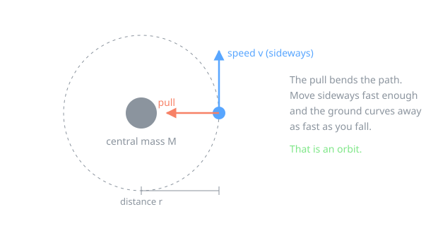
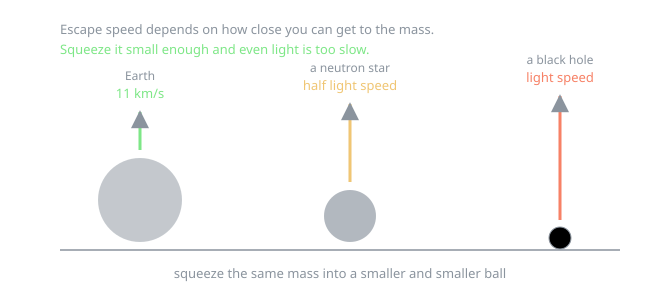
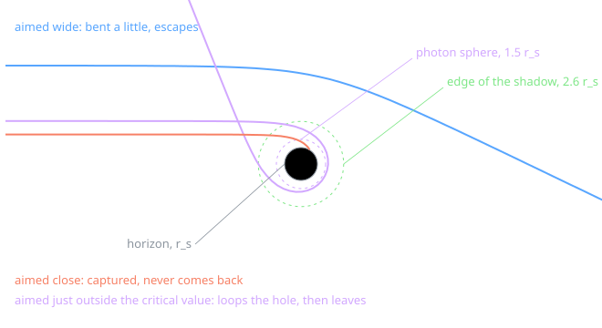
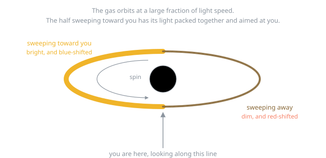
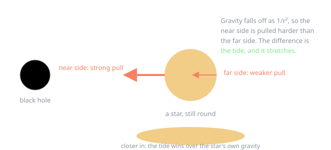
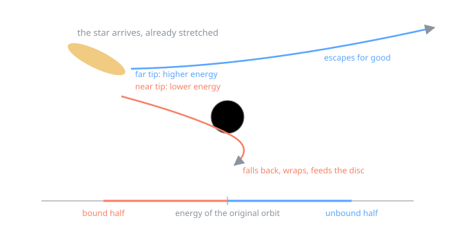
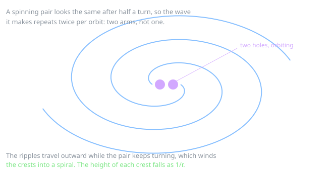
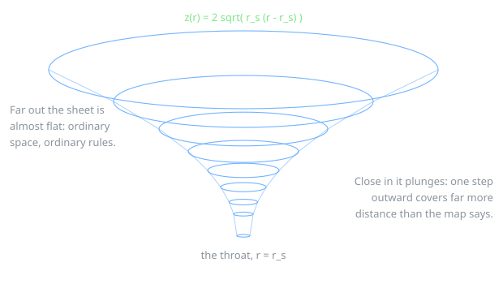

# Where every equation in this app comes from

This is the long version of the physics, written for someone who has met
`speed = distance / time` and not much else. Every formula the code uses is
built up here from things you can check on a playground, and nothing is
introduced without saying where it came from.

You do not need calculus for most of it. Where calculus is unavoidable, the
step is spelled out in words first, and you can take the result on trust
without losing the thread.

**How to read this.** Each part answers one question, ends with the equation
the app actually evaluates, and says which file it lives in. If you only want
the summary, jump to [the table at the end](#every-equation-and-where-it-lives).

---

## Contents

1. [The five things you already know](#1-the-five-things-you-already-know)
2. [Why anything orbits anything](#2-why-anything-orbits-anything)
3. [Escape speed, and the size of a black hole](#3-escape-speed-and-the-size-of-a-black-hole)
4. [Units where the answer is 1](#4-units-where-the-answer-is-1)
5. [Why light bends, and by how much](#5-why-light-bends-and-by-how-much)
6. [The photon sphere and the shadow](#6-the-photon-sphere-and-the-shadow)
7. [The last stable orbit](#7-the-last-stable-orbit)
8. [Why the disc glows, and how hot](#8-why-the-disc-glows-and-how-hot)
9. [Why one side of the disc is brighter](#9-why-one-side-of-the-disc-is-brighter)
10. [Tides, and why they tear stars apart](#10-tides-and-why-they-tear-stars-apart)
11. [Why the debris becomes a stream](#11-why-the-debris-becomes-a-stream)
12. [Gravitational waves and the chirp](#12-gravitational-waves-and-the-chirp)
13. [The funnel: what curved space actually means](#13-the-funnel-what-curved-space-actually-means)
14. [Jets, beaming, and the outflow](#14-jets-beaming-and-the-outflow)
15. [What we cheat on](#15-what-we-cheat-on)
16. [Every equation and where it lives](#every-equation-and-where-it-lives)

---

## 1. The five things you already know

Everything below is built from these.

**Speed.** How far you go divided by how long it took.

**Newton's second law.** Push something and it speeds up. Push twice as hard
and it speeds up twice as fast. Push something twice as heavy and it speeds up
half as fast:

$$F = m\,a$$

**Gravity.** Every mass pulls every other mass. Double either mass and the pull
doubles. Move twice as far away and the pull drops to a quarter, because the
same pull is spread over a sphere four times bigger:

$$F = \frac{G\,M\,m}{r^2}$$

$G$ is just a conversion number that makes the units work out.

**Going in a circle is accelerating.** Even at constant speed, going round a
corner means your direction keeps changing, and changing direction is
acceleration. The amount you need is

$$a = \frac{v^2}{r}$$

Twice the speed needs four times the pull. This is why you lean into a fast
corner on a bike.

**Energy.** Moving costs energy, $\tfrac{1}{2}mv^2$. Being deep in a gravity
well is like being at the bottom of a pit: climbing out costs energy, so we
call the energy down there negative, $-GMm/r$. Add the two together and you get
a number that does not change as the object moves, which makes it enormously
useful.

---

## 2. Why anything orbits anything

Throw a ball sideways and it curves down and lands. Throw it harder and it
lands further away. Throw it hard enough and the ground curves away underneath
it as fast as it falls, and it never lands. That is an orbit. It is not
weightlessness, it is falling forever and missing.

Put numbers on it. The pull available is $GMm/r^2$. The pull required to keep
turning in a circle is $mv^2/r$. Set them equal:

$$\frac{GMm}{r^2} = \frac{mv^2}{r}$$

The mass of the orbiting thing, $m$, appears on both sides and cancels. That is
why a feather and a cannonball orbit identically. Multiply both sides by $r/m$:

$$\boxed{v_{\text{circ}} = \sqrt{\frac{GM}{r}}}$$

Closer in means faster. This one line explains why Mercury runs rings around
Neptune, and why the inner part of the accretion disc shears past the outer
part and winds the pattern into a spiral.

> **In the code:** `vCircular` in `src/sim/gravity.ts`, used everywhere from
> debris launch speeds to the disc's shear rate.

---

## 3. Escape speed, and the size of a black hole

To escape completely you need enough kinetic energy to pay off the whole
gravitational debt. Debt paid means total energy reaches zero:

$$\tfrac{1}{2}mv^2 - \frac{GMm}{r} = 0 \quad\Longrightarrow\quad v_{\text{esc}} = \sqrt{\frac{2GM}{r}}$$

Earth's is 11 km/s. Notice what the formula depends on: not just how much mass,
but how *close to it* you can get. Squeeze the same mass into a smaller ball and
you can stand nearer the centre, so the escape speed goes up.

Now ask the question John Michell asked in 1783: what if we squeeze it so far
that the escape speed reaches the speed of light? Set $v_{\text{esc}} = c$:

$$c = \sqrt{\frac{2GM}{r}} \quad\Longrightarrow\quad \boxed{r_s = \frac{2GM}{c^2}}$$

This is the **Schwarzschild radius**. For the Sun it is about 3 km. For the
Earth, 9 mm.

**An honest warning.** That derivation is a fluke. It treats light as a slow
cannonball, which is wrong, and it says light "falls back", which is also
wrong. The correct calculation is Karl Schwarzschild's 1916 solution of
Einstein's equations, and it happens to give exactly the same number. Take the
formula, discard the story: nothing falls back, the horizon is a one way door.

> **In the code:** `R_S` in `src/physics/constants.ts`.

---

## 4. Units where the answer is 1

Physicists get tired of writing $G$ and $c$, so they choose units where both
equal 1. It is the same trick as measuring travel in "hours away" instead of
kilometres: you have folded the speed into the unit.

With $G = c = 1$, the Schwarzschild radius becomes

$$r_s = 2M$$

This app goes one step further and measures every length in Schwarzschild
radii, so $r_s = 1$ and therefore $M = \tfrac{1}{2}$. When you see `0.5` in the
shader where you expected a mass, that is why. A distance of `12` means twelve
Schwarzschild radii from the centre.

> **In the code:** `src/physics/constants.ts` has the whole convention in one
> comment block.

---

## 5. Why light bends, and by how much

Light has no mass, so how can gravity pull on it?

Einstein's answer starts with a thought experiment you can almost do. Imagine a
windowless lift. If it sits on Earth you feel pressed to the floor. If it is
being towed through empty space at $9.8\ \text{m/s}^2$ you feel exactly the
same. **There is no experiment inside the lift that tells the two apart.** That
is the equivalence principle.

Now shine a torch across the lift while it accelerates. The beam leaves one
wall, and by the time it crosses, the lift has moved up a little, so the spot
lands slightly low. Inside the lift, the light looks bent. And if acceleration
and gravity are indistinguishable, then **gravity must bend light too**.

The next step is the one that made Einstein famous. He found that light bends
by *twice* what you get from pretending a photon is a cannonball. The full
weak-field result, for a ray that passes at closest distance $b$:

$$\alpha \simeq \frac{4GM}{bc^2} = \frac{2 r_s}{b}$$

Eddington measured it during the 1919 eclipse, got the factor of two rather
than one, and Einstein was on the front page of every newspaper.

Close to the hole, "bends a bit" is no longer enough and we need the exact
path. Writing $u = 1/r$ (so big $u$ means close in) and tracking the ray by the
angle $\phi$ it has swept around the hole, general relativity gives

$$\frac{d^2u}{d\phi^2} + u = \tfrac{3}{2} r_s u^2$$

Read it as two pieces. **Without** the right-hand side, this is the equation for
a straight line written in polar coordinates, which you can check by putting in
$u = \sin\phi / b$. **With** it, the line curves, and the correction grows as
$u^2$, so it is negligible far away and dominant close in. All of relativistic
lensing is in that one extra term.

The app does not integrate in $\phi$, because a shader ray needs to move in
$x, y, z$. The same equation in vector form is

$$\ddot{\mathbf{x}} = -\tfrac{3}{2}\, r_s\, h^2\, \frac{\mathbf{x}}{r^5}, \qquad h = |\mathbf{x} \times \dot{\mathbf{x}}|$$

where $h$ is the ray's angular momentum about the hole, which stays constant
along the path. Every pixel on your screen runs this equation with a
fourth-order Runge-Kutta integrator, a few hundred steps, every frame.

> **In the code:** `centerAccel` in `src/render/shaders/geodesic.frag`, and the
> same equation on the CPU in `src/physics/geodesic.ts` so the drawn photon
> paths land exactly on the features the shader renders.

---

## 6. The photon sphere and the shadow

Aim a ray at the hole and the only thing that matters is $b$, how far off
centre you aimed. Three things can happen, and there is a sharp line between
them.

To find the line, use energy bookkeeping. For light, the "how close can I get"
question reduces to comparing $1/b^2$ against the function

$$V(r) = \frac{1}{r^2}\left(1 - \frac{r_s}{r}\right)$$

A ray can reach radius $r$ only where $1/b^2 > V(r)$. So the deciding feature is
the **highest point** of $V$, the hill the ray has to get over.

Find it by differentiating and setting to zero:

$$\frac{dV}{dr} = -\frac{2}{r^3} + \frac{3r_s}{r^4} = 0 \quad\Longrightarrow\quad \boxed{r_{\text{ph}} = \tfrac{3}{2} r_s = 3M}$$

That is the **photon sphere**: the radius where light can orbit in a circle.
It is a knife-edge, not a place to park. Nudge inward and you spiral in; nudge
outward and you spiral away.

The height of the hill sets the dividing aim. Put $r = 3M$ back into $V$:

$$V_{\max} = \frac{1}{(3M)^2}\left(1 - \frac{2M}{3M}\right) = \frac{1}{9M^2}\cdot\frac{1}{3} = \frac{1}{27M^2}$$

and a ray just clears the hill when $1/b^2 = V_{\max}$, giving

$$\boxed{b_{\text{crit}} = \sqrt{27}\,M = 3\sqrt{3}\,M = \frac{3\sqrt{3}}{2} r_s \approx 2.598\, r_s}$$

This is the single most important number in the picture, because **it is the
size of the black shadow you see**. Note that it is 2.6 times the horizon, not
1. The dark disc in the image is considerably bigger than the hole itself,
because rays that would have missed a merely dark ball are still bent in.

Just outside that edge sits the **photon ring**, the bright thin circle in
every image, made of light that looped one or more times before escaping to
your eye.

> **In the code:** `B_CRIT` and `R_PHOTON` in `src/physics/constants.ts`.

---

## 7. The last stable orbit

Around a star, every circular orbit is stable: nudge a satellite and it
wobbles a bit, then carries on. Around a black hole this stops being true
below a certain radius, and the reason is the same hill from Part 6, now for
matter instead of light. Below

$$r_{\text{ISCO}} = 6M = 3\, r_s$$

the hill has no dip left to sit in, so the smallest nudge means falling in.
This is the **innermost stable circular orbit**, and it is why the accretion
disc has an inner edge with nothing inside it.

Solving the full relativistic orbit for every debris particle would be
expensive, so the app uses a shortcut that gets the important behaviour exactly
right: the **Paczyński-Wiita potential**

$$\Phi(r) = -\frac{GM}{r - r_s}$$

The only change from Newton is $r \to r - r_s$, which makes gravity blow up at
the horizon instead of at the centre. That small edit reproduces the true ISCO
at $3\,r_s$, so matter destabilises and plunges in exactly the right place.

Redo Part 2's balance with this potential. The inward pull is now
$GM/(r-r_s)^2$, so

$$\frac{v^2}{r} = \frac{GM}{(r - r_s)^2} \quad\Longrightarrow\quad \boxed{v_{\text{circ}} = \frac{\sqrt{GM\,r}}{r - r_s}}$$

and the energy bookkeeping that decides whether debris is bound or escaping is

$$\varepsilon = \tfrac{1}{2}v^2 - \frac{GM}{r - r_s}$$

Negative means bound and it will come back. Positive means gone. The app
computes exactly this for every particle at the moment it is born, and that
single sign is what splits a shredded star into the half that returns and the
half that escapes.

> **In the code:** `R_ISCO` in `src/physics/constants.ts`, the potential in
> `src/sim/gravity.ts`, the bound test in `boundFlag` in `src/sim/debris.ts`.

---

## 8. Why the disc glows, and how hot

Gas cannot fall straight in. It arrives with some sideways motion, so it ends
up circling, and collisions between gas on slightly different orbits flatten
the whole mess into a disc, the same way a spinning ball of pizza dough
flattens.

Now the important part. Neighbouring rings orbit at *different* speeds (Part 2),
so they rub. Rubbing converts orbital energy into heat, the gas radiates that
heat away, loses energy, and sinks a little closer in, where it rubs even
harder. The disc is a machine for converting gravitational energy into light,
and it is a spectacularly efficient one: several percent of the rest mass of
everything it swallows, against 0.7% for hydrogen fusion.

The temperature profile follows from three statements:

1. Energy released by matter sinking from $r + dr$ to $r$ is set by gravity.
2. In a steady state the heat generated in a ring must leave it as light, so
   heat in equals $\sigma T^4$ out (Stefan-Boltzmann).
3. At the inner edge there is nothing further in to grip, so no torque acts
   there. This "no-torque inner boundary" forces the emission to zero at
   $r_{\text{in}}$.

Together they give the **Shakura-Sunyaev** profile:

$$T(r) \propto r^{-3/4}\left(1 - \sqrt{\frac{r_{\text{in}}}{r}}\right)^{1/4}$$

The $r^{-3/4}$ is the "closer is hotter" part. The bracket is the no-torque
boundary, and it is why the disc fades right at its inner rim instead of being
brightest there.

> **In the code:** `discEmission` in `src/render/shaders/geodesic.frag`, with
> $r_{\text{in}} = 3 r_s$.

---

## 9. Why one side of the disc is brighter

Look at any picture of an accretion disc and one side is glaringly brighter.
That is not artistic licence. Three effects stack, and all three are in this
app.

**Doppler shift.** A source coming toward you has its light waves squashed
together, so it looks bluer, and going away it looks redder. You hear this with
sirens. At the ISCO the gas is orbiting at half the speed of light, so the
effect is enormous.

**Beaming.** Fast-moving sources do not radiate evenly. Their light is swept
into a forward-pointing cone, like rain on a windscreen appearing to come from
straight ahead when you drive fast. The approaching side of the disc aims its
cone at you.

**Gravitational redshift.** Climbing out of the gravity well costs energy, and
a photon pays by getting redder. Deeper in means redder.

The app folds all three into one number, the ratio of received to emitted
frequency:

$$g = \frac{\sqrt{1 - \dfrac{3M}{r}}}{\gamma\left(1 - \beta \cos\alpha\right)}, \qquad \gamma = \frac{1}{\sqrt{1 - \beta^2}}$$

The top is the gravitational part for gas on a circular orbit. The bottom is
the Doppler part, with $\beta = v/c$ and $\alpha$ the angle between the gas's
motion and the direction the light leaves in. Brightness then scales as a power
of $g$, and colour shifts by moving the blackbody temperature by the same
factor.

Two details this app gets right that are easy to get wrong:

- $\beta$ is taken from the **Paczyński-Wiita** circular speed, so it reaches
  0.5 at the ISCO as it should.
- $\alpha$ uses the **bent** photon direction at the point where the ray crosses
  the disc, not the straight line back to the camera. That is why the lensed
  image of the disc's far side, the part arcing over the top of the hole,
  beams correctly too.

> **Honest note.** The exact bolometric scaling for a moving blackbody surface
> is $g^4$. The app uses $g^3$, which softens the contrast slightly and is a
> deliberate art choice; it is the `BEAM_EXP` define in
> `src/render/blackHolePass.ts` if you want the honest exponent.

---

## 10. Tides, and why they tear stars apart

The Moon does not pull the Earth apart, but it does pull the near ocean harder
than it pulls the planet's centre, and the far ocean less. That difference is
the tide, and it stretches.

Put numbers on the difference. Gravity at distance $r$ goes as $1/r^2$. For a
body of radius $R$ whose centre is at $r$, the near side sits at $r - R$:

$$\Delta a = \frac{GM}{(r-R)^2} - \frac{GM}{r^2} \approx \frac{2GMR}{r^3}$$

(the approximation is just "$R$ is small compared to $r$", which holds until the
very end). Notice the $1/r^3$: **tides grow much faster than gravity itself as
you approach**. This is the entire story of spaghettification.

A star fights back with its own gravity, which holds its surface down with
about $Gm_\star/R^2$. Set the tide equal to the self-gravity and solve for
where the star loses:

$$\frac{2GMR}{r^3} = \frac{Gm_\star}{R^2} \quad\Longrightarrow\quad \boxed{r_T \approx R_\star \left(\frac{M}{m_\star}\right)^{1/3}}$$

This is the **tidal radius**. Outside it the star survives, inside it comes
apart.

**The surprising bit.** Compare $r_T$ to the horizon. Since $r_s \propto M$ and
$r_T \propto M^{1/3}$:

$$\frac{r_T}{r_s} \propto M^{-2/3}$$

So the *bigger* the black hole, the *closer in* the tidal radius sits relative
to the horizon. Around a stellar-mass hole a star is shredded far outside, in a
violent flash. Around a hole of ten billion suns, $r_T$ has moved inside the
horizon: the star crosses intact and nothing is seen from outside at all. The
spectacular disruptions come from the middle of the range, around a million
solar masses.

This is also why the app's tidal radii sit outside the disc: it is drawing the
supermassive case.

> **In the code:** `TDE_TUNING` in `src/config.ts`, phase thresholds in
> `src/sim/tidal.ts`.

---

## 11. Why the debris becomes a stream

Here is the part that took the longest to get right in this project, and the
part most illustrations quietly skip.

When the star comes apart it is already stretched, so its near tip sits deeper
in the gravity well than its far tip. Deeper means more tightly bound. The
spread in orbital energy across the star is roughly the tidal potential
difference across its diameter:

$$\Delta \varepsilon \approx \frac{GM R_\star}{r_p^2}$$

where $r_p$ is how close the star got. Compare that to the energy the star had
on the way in, which for a star wandering in from far away is about zero, and
you get a startling result: **the spread is much larger than the original
energy**. So the debris straddles zero. Half of it ends up bound, half of it
ends up unbound, and the split is close to fifty-fifty.

The bound half swings back out on long stretched orbits, returns, and wraps
around the hole. That returning ribbon is the stream you see. The rate at
which it comes back follows a famous power law, $\dot M \propto t^{-5/3}$
(Rees, 1988), which is how real tidal disruption flares are identified.

**Where the $-5/3$ comes from.** It falls out of Kepler and nothing else. Take
the energy spread to be flat across the star, so equal masses of debris landed
in equal slices of binding energy:

$$\frac{dM}{d|\varepsilon|} = \text{constant}$$

A bound fragment with binding energy $|\varepsilon|$ is on an ellipse whose size
is fixed by that energy alone, $a = GM / (2|\varepsilon|)$, and Part 2's orbit
equation gives the time it takes to come back:

$$T = 2\pi\sqrt{\frac{a^3}{GM}} = 2\pi\, GM\, (2|\varepsilon|)^{-3/2}$$

Tightly bound debris returns quickly, barely bound debris takes almost forever.
Now turn the question round: at time $t$ after the disruption, *which* fragments
are arriving? The ones whose period is $t$:

$$|\varepsilon|(t) = \tfrac{1}{2}\left(\frac{2\pi GM}{t}\right)^{2/3}$$

The mass arriving per second is the mass sitting in each slice of energy times
how fast that energy window sweeps downward:

$$\frac{dM}{dt} = \frac{dM}{d|\varepsilon|}\cdot\left|\frac{d|\varepsilon|}{dt}\right|
= \frac{dM}{d|\varepsilon|}\cdot\frac{1}{3}\,(2\pi GM)^{2/3}\, t^{-5/3}$$

$$\boxed{\dot M \propto t^{-5/3}}$$

Everything about the star cancels except the constant out front. That is why the
exponent, and not the brightness, is the thing surveys look for.

**The trap.** Energy is not the only thing that matters: angular momentum
decides how close the debris passes on its return. Give a particle a kick along
its direction of travel and you change its energy *and* strip its angular
momentum, so its return pass dives into the hole and the stream never forms.
Give it a **radial** kick and the angular momentum is untouched, so it keeps the
star's pericenter and swings back out.

This app applies the spread radially for exactly that reason, and launches each
particle onto the star's own orbit at its own radius rather than copying the
star's velocity vector. Both decisions were arrived at by watching the stream
fail without them.

**Watching for the law, and not finding it.** The app can plot its own version
of that curve: turn on *Light curve* and it records how hard the disruption is
feeding the disc against time since the star came apart, on log axes, with the
$t^{-5/3}$ law drawn through the peak for comparison.

The two do not agree, and the overlay is built to show that rather than hide it.
A realistic-mode star at the shipped settings decays like $t^{-7.3}$, four times
steeper than the law. Three reasons, all of them ours and none of them nature's:

- **What is plotted is not the fallback rate.** It is the disc's feeding glow,
  which is the absorbed-debris rate smeared by an exponential decay time
  (`DISC_TUNING.boostDecayTau`). Once the last particle is swallowed the curve is
  that decay and nothing else, and an exponential on log axes gets steeper
  without limit.
- **The debris is not left alone to return.** A small drag circularises it on a
  fixed timescale, so the whole bound half is eaten within about a factor of two
  in time instead of spreading over the decades a real energy distribution
  covers. A hard age limit kills the longest-period debris, which is exactly the
  material that would have made the late tail.
- **The clock is compressed.** The feeding glow decays on the simulation clock
  while the chart is drawn on the disruption clock, so the *Disruption speed*
  slider changes the fitted slope: about $-12.5$ at compression 4, $-7.3$ at 8,
  $-3.3$ at 30. A measurement of nature would not care where that slider is.

Cinematic mode fits about $-1.85$, which looks like a match and is not one: that
mode is a drag-driven spiral with no energy spread at all, so it has no fallback
to obey, and its number moves with the same slider. The chart therefore prints
the fitted index next to the law's and anchors the reference line at the
recorded peak instead of fitting its height, so the gap is always on screen.

> **In the code:** `spawnFromBody` in `src/sim/debris.ts`, the orbit
> reconstruction in `src/sim/orbit.ts`, and the tests in
> `src/sim/__tests__/stream.test.ts` that hold the resulting shape in place.
> The light curve itself is `src/ui/lightCurve.ts` (the recorder and the
> log-log projection) and `src/ui/lightCurveChart.ts` (the canvas), with
> `src/ui/__tests__/lightCurve.test.ts` and
> `src/ui/__tests__/fallbackLaw.test.ts`, the second of which drives real
> disruptions and pins every number quoted above.

---

## 12. Gravitational waves and the chirp

If mass curves space, then *moving* mass makes ripples in it. Wiggle a mass and
the curvature nearby wiggles, and that wiggle travels outward at the speed of
light. Those are gravitational waves.

**Why two crests per orbit.** A spinning dumbbell looks identical after half a
turn. The wave it makes therefore repeats twice per orbit, so the gravitational
wave frequency is **twice** the orbital frequency. This is not a detail: it is
how you know a detected chirp came from an orbit.

Waves carry energy, and that energy is stolen from the orbit, so the pair must
spiral together. Peters worked out the rate in 1964:

$$\frac{da}{dt} = -\frac{64}{5}\,\frac{G^3\, m_1 m_2 (m_1 + m_2)}{c^5\, a^3}$$

Look at the $1/a^3$. When the holes are far apart the decay is glacial. As they
close, the shrinking accelerates violently, which drives the frequency up, which
radiates harder still, which shrinks it faster. The runaway ends in a merger,
and the rising tone it produces is the **chirp** that LIGO heard in 2015.

At the end, the merged hole is *lighter* than the sum of its parts, because the
missing mass left as waves:

$$E_{\text{rad}} \approx 0.048\, M_{\text{tot}} \cdot \frac{\eta}{0.25}, \qquad \eta = \frac{m_1 m_2}{(m_1+m_2)^2}$$

normalised to GW150914, which radiated about 4.6% of itself, roughly three
solar masses converted to ripples in space, briefly outshining every star in
the observable universe put together.

The wave pattern drawn on the curvature grid has amplitude falling as $1/r$
(not $1/r^2$: waves carry energy, and energy spreads over an area, so the
*amplitude* falls as the square root of that), two crests per turn, and the
crests wound into a spiral because the source keeps rotating while the ripples
travel outward.

> **In the code:** `src/sim/binary.ts` for the inspiral, and
> `src/sim/gravitationalWave.ts` for the pattern on the grid, with tests for
> both.

---

## 13. The funnel: what curved space actually means

You have seen the rubber sheet with a bowling ball on it. It is a bad analogy
(it explains gravity using gravity), but there is a real, precise version of
that picture, and this app draws the real one.

Here is the idea. Around a black hole, if you measure the circumference of a
circle and divide by $2\pi$, you get a number. But if you then physically walk
outward and measure the distance to the next circle, **you get more distance
than the difference in those numbers says you should**. Space is stretched in
the radial direction.

We can draw exactly that. Take a flat 2D sheet, and bend it in a third
direction so that walking outward along the *bent* sheet covers the extra
distance. The extra vertical rise stores the stretch.

The Schwarzschild solution says radial distance and circumference are related by

$$ds^2 = \frac{dr^2}{1 - r_s/r}$$

so the true radial distance for a step $dr$ is longer than $dr$ by that factor.
Our bent sheet must satisfy Pythagoras: rise squared plus run squared equals
true distance squared,

$$dz^2 + dr^2 = \frac{dr^2}{1 - r_s/r}$$

Solve for the slope:

$$\left(\frac{dz}{dr}\right)^2 = \frac{1}{1 - r_s/r} - 1 = \frac{r_s}{r - r_s}$$

Take the square root and integrate ($\int \sqrt{r_s/(r-r_s)}\,dr$, substituting
$w = r - r_s$ makes it a plain $\int \sqrt{r_s/w}\,dw$):

$$\boxed{z(r) = 2\sqrt{r_s\,(r - r_s)}}$$

This is **Flamm's paraboloid**, and it is the funnel the app draws when you
press `G`. Far away the slope goes to zero, so the sheet flattens into ordinary
space. At $r = r_s$ the slope goes vertical, which is the throat.

**What it is not.** It is a picture of *one slice of space at one moment*, not
of spacetime, and the vertical direction is not a direction you can move in.
Nothing "rolls downhill" on this surface. Gravity in relativity comes from the
bending of *time* at least as much as space, and none of that is in the
picture. It is an honest visualisation of one true thing, not of everything.

> **In the code:** `embeddingDepth` in `src/render/spacetimeGrid.ts`, with the
> wave from Part 12 added on top.

---

## 14. Jets, beaming, and the outflow

Two very different things come out of the poles, and this app draws both.

**The jet** is a narrow beam of plasma moving at nearly the speed of light.
Because it is so fast, the beaming from Part 9 applies in an extreme form. For
a steady jet the observed brightness scales as

$$\delta^3, \qquad \delta = \frac{1}{\gamma\left(1 - \beta\cos\theta\right)}$$

where $\theta$ is the angle between the jet and your line of sight. Point it at
you and $\delta$ is large; point it away and $\delta$ is small. Cubed, this
turns a symmetric pair of jets into one blazing beam and one you can barely
find. Real radio galaxies show exactly this asymmetry, and the app reproduces
it: the two cones are physically identical and only the geometry differs.

**The outflow** is a different animal: slow, wide, and ragged. It appears when
the hole is being fed faster than it can comfortably swallow. There is a limit,
the **Eddington luminosity**, where the outward push of radiation on infalling
gas balances gravity:

$$L_{\text{Edd}} = \frac{4\pi G M m_p c}{\sigma_T}$$

Above that, radiation pressure wins and blows material away. A tidal disruption
dumps half a star onto a disc in a few weeks, which is far above the limit, so
a broad wind is launched. In this app the outflow's strength is tied to the
disc's feed rate for exactly that reason: it swells during fallback and dies
away with it.

> **In the code:** `jetEmission` and `windEmission` in
> `src/render/shaders/geodesic.frag`.

---

## 15. What we cheat on

A physics document that only lists what it gets right is advertising. Here is
the other column.

| Cheat | Why | What would fix it |
|---|---|---|
| **No spin.** Schwarzschild, not Kerr. | Kerr geodesics are a rewrite of the core integrator. | Real holes spin, which drags space around with them, skews the shadow, and moves the ISCO in to $1.24\,r_s$. |
| **Two holes are superposed, not solved.** | The real two-body problem in GR needs supercomputers. | Numerical relativity. Our double shadows and eyebrow images are qualitatively right, quantitatively not. |
| **Matter is pseudo-Newtonian.** | Full geodesic motion for 48,000 particles is too slow. | Paczyński-Wiita gets the ISCO exactly right, which is the part that matters visually. |
| **The disc is infinitely thin.** | A volumetric disc multiplies the per-pixel cost. | Raymarched volume with real optical depth. |
| **The jet is drawn, not launched.** | Blandford-Znajek needs spin, which we do not have, plus magnetohydrodynamics. | GRMHD simulation data. The beaming, at least, is computed and not painted. |
| **Two clocks run fast.** | A disruption takes days, an inspiral from $8\,r_s$ takes about 1600 time units. | Nothing: the trajectories are exact, only the clock is compressed, and the app says so in the interface. |
| **The light curve is not the fallback law.** | We plot the disc's feeding glow, which is the absorbed-debris rate smeared by a decay time, fed by debris that a drag term circularises on a fixed timescale. | Leave the debris on its own orbits and plot the arrival rate directly. As it stands the curve decays like $t^{-7.3}$, so the app draws the law next to it and says which is which. |
| **No light travel-time delay.** | You see the whole disc at one instant rather than each part as it was when its light left. | Track photon arrival times through the march. |
| **The sky is invented.** | It follows real structure (luminosity function, dust extinction, clustering) but it is not a star catalogue. | A real survey texture, at the cost of every image looking identical. |

---

## Every equation and where it lives

| Quantity | Equation | Code |
|---|---|---|
| Circular orbit speed | $v = \sqrt{GM/r}$ | `sim/gravity.ts` |
| Escape speed | $v = \sqrt{2GM/r}$ | Part 3, sets $r_s$ |
| Schwarzschild radius | $r_s = 2GM/c^2$ | `physics/constants.ts` |
| Light deflection, weak field | $\alpha = 2r_s/b$ | Part 5 |
| Photon path | $\ddot{\mathbf{x}} = -\tfrac{3}{2} r_s h^2 \mathbf{x}/r^5$ | `shaders/geodesic.frag`, `physics/geodesic.ts` |
| Photon sphere | $r = 1.5\,r_s$ | `physics/constants.ts` |
| Shadow radius | $b_{\text{crit}} = 3\sqrt{3}M \approx 2.6\,r_s$ | `physics/constants.ts` |
| ISCO | $r = 3\,r_s$ | `physics/constants.ts` |
| Paczyński-Wiita potential | $\Phi = -GM/(r - r_s)$ | `sim/gravity.ts` |
| PW circular speed | $v = \sqrt{GMr}/(r - r_s)$ | `sim/gravity.ts` |
| Specific energy | $\varepsilon = v^2/2 - GM/(r-r_s)$ | `sim/orbit.ts`, `sim/debris.ts` |
| Disc temperature | $T \propto r^{-3/4}(1 - \sqrt{r_{\text{in}}/r})^{1/4}$ | `shaders/geodesic.frag` |
| Doppler + gravity shift | $g = \sqrt{1 - 3M/r}\,/\,\gamma(1 - \beta\cos\alpha)$ | `shaders/geodesic.frag` |
| Tidal radius | $r_T \approx R_\star (M/m_\star)^{1/3}$ | `config.ts` |
| Tidal energy spread | $\Delta\varepsilon \approx GMR_\star/r_p^2$ | `sim/debris.ts` |
| Debris return period | $T = 2\pi GM(2\lvert\varepsilon\rvert)^{-3/2}$ | Part 11 |
| Fallback rate | $\dot M \propto t^{-5/3}$ | `ui/lightCurve.ts` (drawn for comparison) |
| Peters inspiral | $da/dt = -\tfrac{64}{5} G^3 m_1m_2(m_1{+}m_2)/c^5a^3$ | `sim/binary.ts` |
| Radiated mass | $E_{\text{rad}} \approx 0.048 M_{\text{tot}}\,\eta/0.25$ | `sim/binary.ts` |
| Flamm's paraboloid | $z = 2\sqrt{r_s(r - r_s)}$ | `render/spacetimeGrid.ts` |
| Relativistic beaming | $\delta = 1/\gamma(1 - \beta\cos\theta)$, $I \propto \delta^3$ | `shaders/geodesic.frag` |
| Eddington luminosity | $L = 4\pi GMm_pc/\sigma_T$ | Part 14, motivates the outflow |

---

## Where to go next

- **Luminet (1979)**, *Image of a spherical black hole with thin accretion
  disk*. The first computed picture of what this app draws, made with a
  pencil, a mainframe, and no graphics hardware at all.
- **James, von Tunzelmann, Franklin and Thorne (2015)**, the *Interstellar*
  paper. The full version of Parts 5 to 9, written by the people who did it
  for the film.
- **Rees (1988)** on tidal disruption, for Parts 10 and 11.
- **Peters (1964)** for Part 12, four pages that predicted a sound nobody heard
  for fifty-one years.
